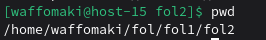
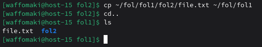
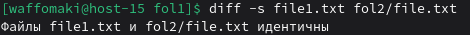
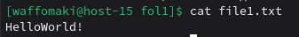
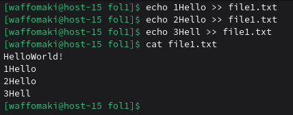
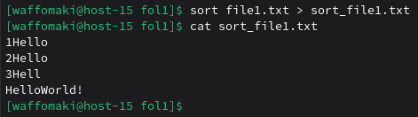
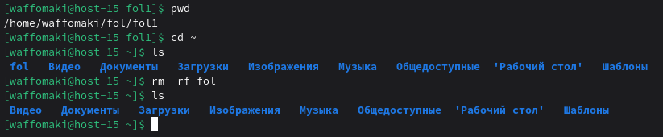

# Работа в консольке

1) Переместиться между директориями<br>
```cd <путь>``` - переход по директории
```cd ..``` - подняться на уровень
```cd ~``` - возврат в доманюю директорию
2) Вывести список файлов в директории
```ls```
3) Вывести список Всех файлов в директории
```ls -a``` - для вывода скрытых файлов
4) Создать папку с подпапками
```mkdir fol1``` - создание директории
```mkdir -p fol/sfol/``` - создание дерева директорий
5) Внутри папки создать файлик и записать в него что-нибудь
```cd fol1```
```touch file.txt``` - создание текстового файла file.txt
```echo (текст) > file.txt``` - записывает строку + '\n' в конце, содержимое перезаписывается. Без перевода используется флаг '-n'.
Вводим: ```echo HelloWorld! > file.txt```
6) Переместить файл из одно директории в другую
Создадим еще одну папку в fol1: ```mkdir fol2```
Переместим: ```mv file.txt fol2```
7) скопировать файл из одной директории в другую

```cp ~/fol/fol1/fol2/file.txt ~/fol/fol1``` - копирование файла

8) переименовать файл
```mv file.txt file1.txt```
9) сравнить содержимое файла
Команда ```diff <file1> <file2>``` сравнивает файлы построчно.
Значит, ```diff file1.txt fol2/file.txt```.
Можно добавить флаг ```-s```, чтобы было видно наглядно:

10) отсортировать содержимоей файла по возрастанию и убыванию
```cat file1.txt``` - вывод содержимого текстового файла:

Строка одна, поэтому дополним файл:
```echo 1Hello >> file1.txt```
```echo 2Hello >> file1.txt```
```echo 3Hell >> file1.txt```
Используем ```>>``` для перенаправления с добавлением.
Результат:

Сортируем: ```sort file1.txt > sort_file1.txt``` (флаг ```-r``` по убыванию, ```-n``` для чисел, ```-f``` для игнорирования регистров)
Результат:

11) удалить все папки и файлы
Используем ```rm -rf``` для рекурсивного удаления:
