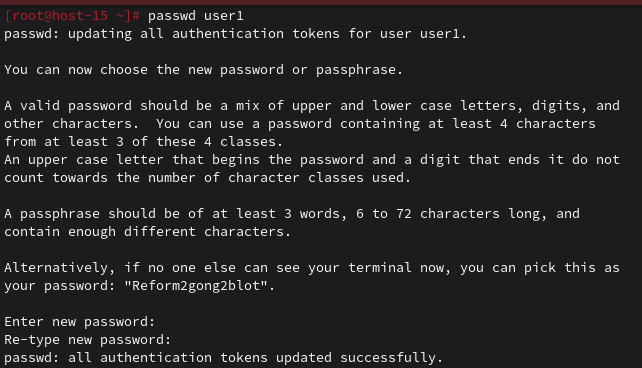
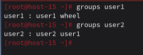
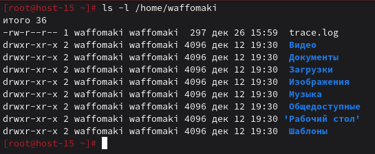
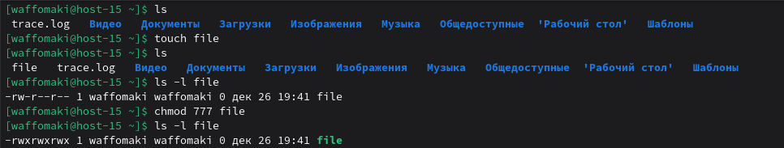
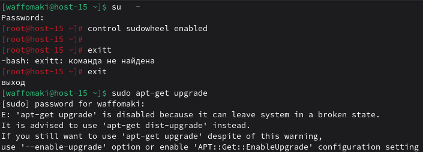
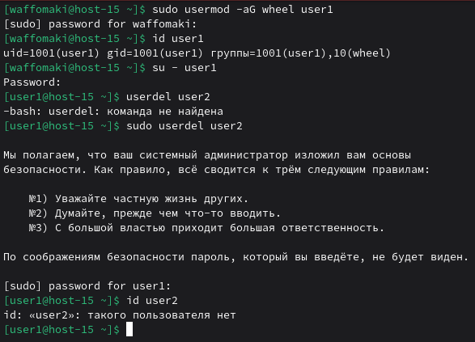
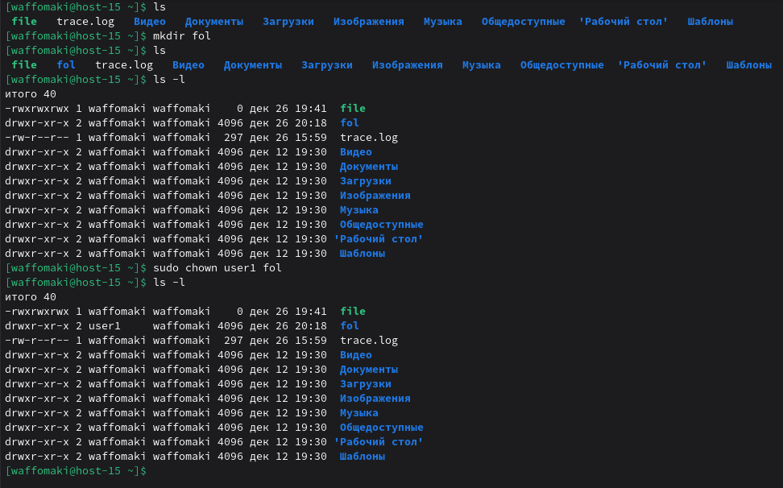

# Управление пользователями

1) Добавьте пользователей user1 и user2:<br>
    1.1) user1 - оболочка bash<br>
    Заходим под рутом ```su -```<br>
    Используем команду ```sudo useradd -s /bin/bash user1```:<br>
    Здесь -s означает другую оболочку.<br>
    1.2) user2 - оболочка sh<br>
    Используем команду ```sudo useradd -s /bin/sh user2```:<br>
    1.3) установите им пароли<br>
    Используем команду ```passwd <пользователь>```. Пример для user1:<br>
    <br>
    Пароль для user1: pSwUsR1<br>
    Пароль для user2: pSwUsR2<br>

2) Назначьте пользователю 1 группу администраторов, польователя 2 добавте в группу пользователя 1
В дистрибутиве альта у админов группа wheel, поэтому:<br>
```usermod -aG wheel user1```<br>
-a указывает, что группы добавляются в список дополнительных групп пользователя. Только опция -G: пользователь удаляется из любых дополнительных групп, которые не указаны в команде.<br>
Аналогично для группы user1 для пользователя user2:<br>
```usermod -aG user1 user2```<br>
Результат:<br>
<br>
3) Что такое права доступа? Выведите права доступа на файлы в директории пользователя<br>
Права доступа - это правила, которые определяют, кто может читать, записывать или исполнять какие-то файлы либо каталоги<br>
Проверить права доступа можно через ```ls -l <директори_пользователя>```:<br>
<br>
Так, например, -rw-r--r-- означает: обычный файл (-), чтение и запись (rw-), группа может только читать (r--), остальные могут только читать (r--)<br>
4) Как изменить права на файлы? Создайте файл который будет на который у всез пользователей будут все возможные права<br>
Права редактировать можно через ```chmod <ключ> <установка_прав> <файл>```<br>
Код (восьмиричный) 777 дает полный доступ:<br>
<br>
В символьной записи такой код обозначается как ```rwxrwxrwx``` ('-' означает файл).<br>
5) Как называется учётная запись встренного администратора в linux?<br>
root (суперпользователь)<br>
6) Как выполнить команду от имени администратора?
Использовать префикс sudo перед командой.<br> Однако, такая возможность по умолчанию заблокирована.<br>
Используем команду ```control sudowheel enabled```, чтобы активировать возможность пользователям администраторской группы wheel выполнять команды от имени рута:<br>
<br>
7) Есть ли ограничения у суперпользователя?<br>
В целом, нет, но все же можно, например, установить аттрибут неизменяемости ```chattr +i``` на файл, из-за чего с ним не сможет взаимодействовать даже root пользователь.<br>
8) Удалите пользователя 2 с помощью пользователя 1.<br>
Для удаления пользователя требуются права администратора, поэтому выдадим их через ```sudo usermod -aG wheel user1```.<br>
Через ```su - user1``` авторизируемся, вводя пароль.<br>
Удаляем пользователя: ```sudo userdel user2```<br>
<br>
9) Как можно изменить владельца папки? измените владельца папки из пункта 4<br>
В пункте 4 не было сказано про папку, поэтому создадим ее: ```mkdir fol```<br>
Для изменения владельца папки используется команда ```chown <новый_владелец> <папка>```<br>
Пусть владельцем будет user1, тогда: ```chown user1 fol```.<br>
