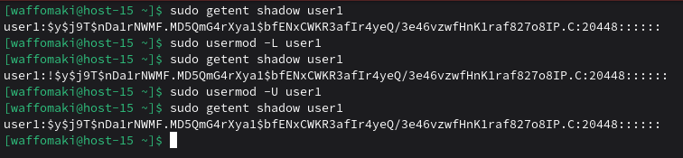
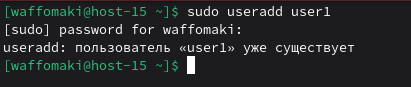

# Запрещаем

1. Запретите пользователю user1 из предыдщуего задания выполнять вход в систему<br>
Для этого используется ```sudo usermod -L user1```, где ```-L``` - lock (блокировка)<br>
2. Как вы это сделали?<br>
Результат использования данной команды - добавление ```!``` в начало хэша пароля user1 в ```/etc/shadow```. Это отключает пароль. Не блокирует вход по SSH-ключу.<br>
<br>
3. Какие ещё способы это сделать вы знаете?<br>
Аналогичная штука: ```sudo passwd -l user1```<br>
4. Можно ли создать пользователей с одинаковыми username?<br>
Нельзя.<br>
<br>