# Продолжаем

1. Выведите содержимое fstab. Что хранится в fstab?<br>
Используем ```cat /etc/fstab```<br>
Файл ```/etc/fstab``` содержит информацию о файловых системах, которые система должна монтировать при загрузке. Он указывает, что монтировать, куда, каким способом и при каких условиях.<br>

2. Добавьте в виртуальную машину ещё один диск<br>
Для VirtualBox:<br>
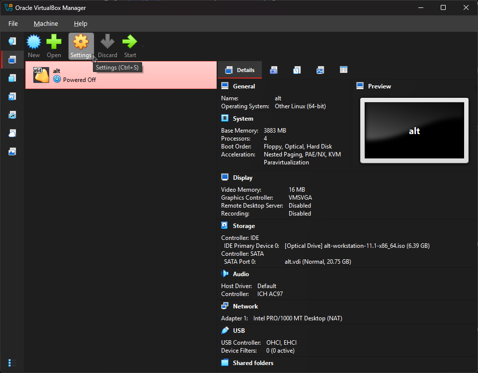<br>
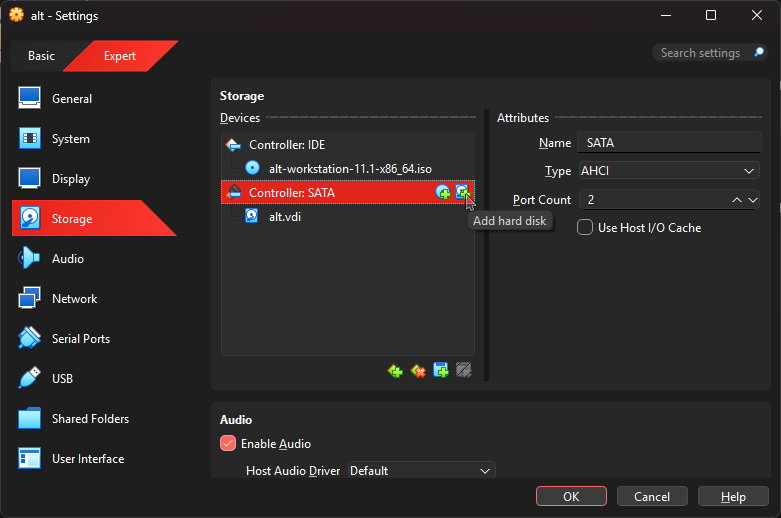<br>
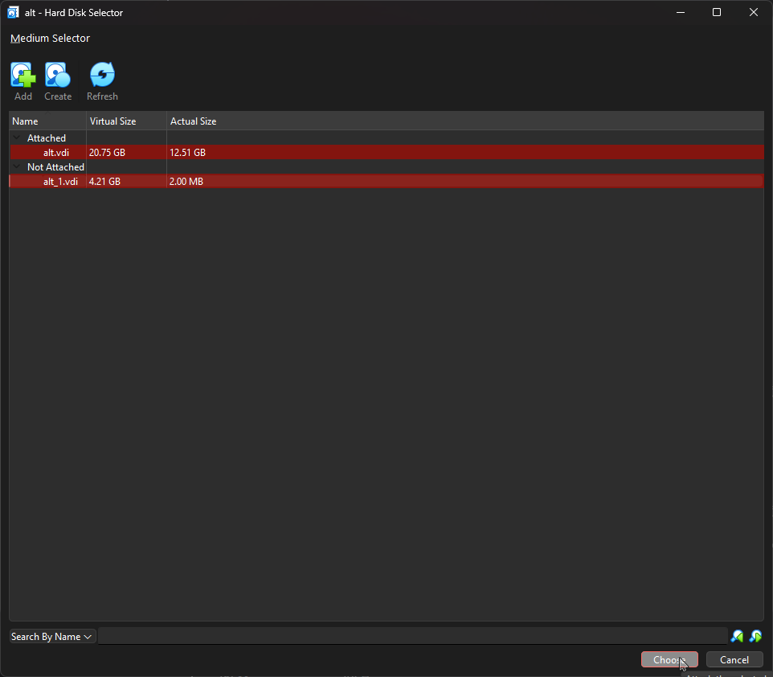<br>

3. Узнайте как ситема видит ваш диск - выведите информацию о блочных устройствах<br>
Запускаем ОС, проверяем диск - ```lsblk```:<br>
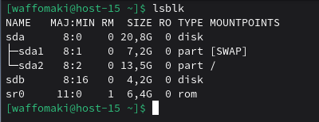<br>
Созданный - sdb.<br>

4. С помощью полученной информации создайте на диске таблицу разделов и фаловую систему ext4<br>
fdisk автоматически создал новую таблицу MBR, потому что ее не было.<br>
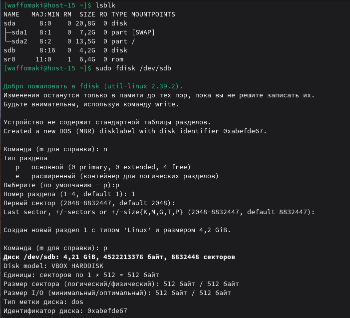<br>
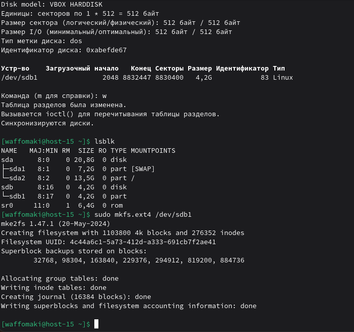<br>

5. Примонитруте диск в каталог /mnt<br>
Для начала убедимся, что ```/mnt``` существуте через ```sudo mkdir -p /mnt```, здесь ```-p``` означает создать, только если не существует.<br>
Монируем раздел: ```sudo mount /dev/sdb1 /mnt```<br>
Проверяем через ```lsblk```:<br>
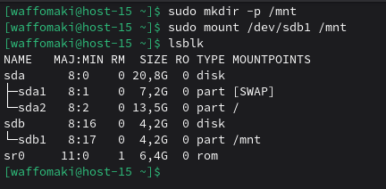<br>

6. Зайдите в каталог и создайте там файлы<br>
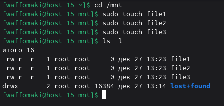<br>

7. Отмонтируйте диск и проверье остались ли файлы<br>
Для отмонтировки используем ```sudo umount /mnt```.<br>
Проверяем:<br>
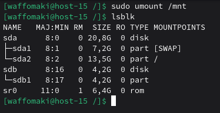<br>
Проверим каталог:<br>
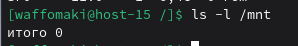<br>
Диск отключен, проверим файлы (смонтируем обратно):<br>
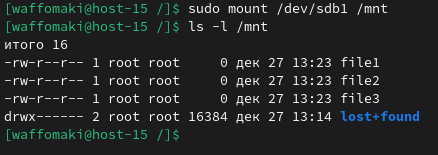<br>
Все на месте.<br>

8. Сделайте так чтобы диск автоматически подключался при загрузке систем ( добавьте информацию о нём с fstab)<br>
Будем работать с UID, потому что имя устройства может поменяться: ```sudo blkid /dev/sdb1```<br>
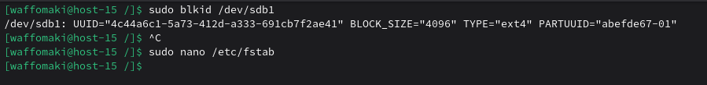<br>
Открываем fstab в nano: ```sudo nano /etc/fstab```<br>
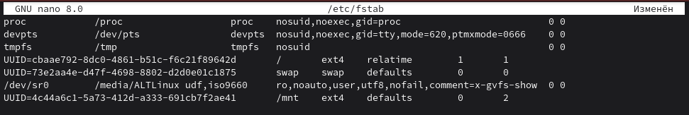<br>
Дописываем последнюю строчку на скриншоте, где:<br>
defaults — стандартные опции (rw, suid, dev, exec, auto, nouser, async)<br>
0 — не делать дамп (резервную копию через dump)<br>
2 — проверять ФС при загрузке (после корневого раздела, который имеет 1)<br>
Сохраняем изменения: Ctrl + O -> Enter -> Ctrl + X<br>

9. Проверьте корретность записанных в fstab данных перед перезагрузкой<br>
Смонтируем все, что в ```/etc/fstab``` - ```sudo mount -a```:<br>
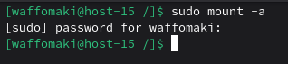<br>
Никаких ошибок.
Перепроверим, что диск смонтирован:<br>
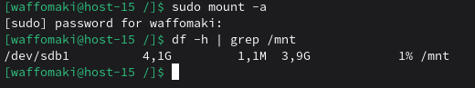<br>

10. Перезагрущите систему и убедитесь что диск был подключён к системе
Аналогично предыдущему шагу, перепроверим, что диск смонтирован:<br>
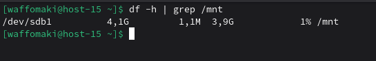<br>
Автоматическое монтирование работает.