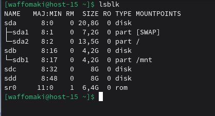
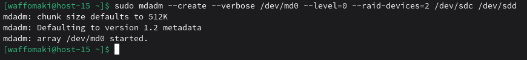
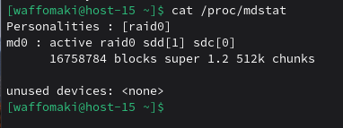
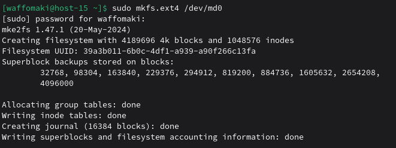
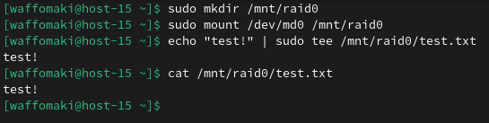
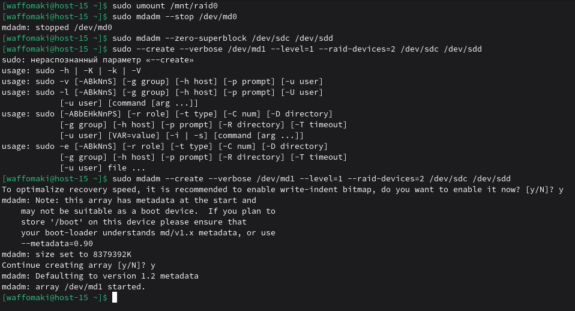

# Продолжаем

1. Raid массивы, что такое икакие бывают <br>
RAID (Redundant Array of Independent Disks)-массивы - это программные массивы, которые объединяют несколько физических дисков (или их разделов) в единую логическую структуру.<br>
Какие бывают: RAID 0 (Striping), RAID 1 (Mirroring), RAID 5 (Striping с контрольной суммой), RAID 6, RAID 10 (комбинация RAID 1 и 0)<br>

2. Добавьте в виртуальную машину 2 диска отформатируйте их в ext4<br>
После добавления двух дисков (sdc, sdd):<br>
<br>
Так как нам предстоит в будущем создать из них raid 0, только после создания raid-массива следует создавать ext4.<br>

3. Создайте из них raid 0 массив<br>
Установим для работы mdadm (Multiple Device Admin), хоть и может быть установлен: ```sudo apt-get install mdadm```<br>
Создаем RAID 0: ```sudo mdadm --create --verbose /dev/md0 --level=0 --raid-devices=2 /dev/sdc /dev/sdd```<br>
--create - указывает, что нужно создать новый RAID-массив.<br>
--verbose - включает подробный вывод информации о процессе.<br>
/dev/md0 - имя создаваемого RAID-устройства (md0 — первое RAID-устройство в системе).<br>
--level=0 - задаёт уровень RAID 0<br>
--raid-devices=2 - указывает количество устройств (дисков), участвующих в массиве. Здесь - 2.<br>
<br>
Проверяем - ```cat /proc/mdstat```:
<br>
Прошло успешно.<br>

4. Проверье всё ли работает<br>
Создадим ФС на массиве: ```sudo mkfs.ext4 /dev/md0```<br>
<br>
Заодно проверим работу:<br>
<br>
Все работает.<br>

5. Удалите raid0 и создайте raid1<br>
Удалим raid0:<br>
Размонируем: ```sudo umount /mnt/raid0```<br>
Остановим RAID-массив: ```sudo mdadm --stop /dev/md0``` (stop - останавливает массив)
Удаление метаданных RAID: ```sudo mdadm --zero-superblock /dev/sdc /dev/sdd``` (zero-superblock - стирает суперблок RAID, записанный в начале (или в конце) диска)<br>
Создадим raid1:<br>
```sudo mdadm --create --verbose /dev/md1 --level=1 --raid-devices=2 /dev/sdc /dev/sdd```
Соглашаемся на включение bitmap для ускорения восстановления после сбоев.<br>
Подтверждаем создание массива.
<br>

6. В чём между ними разница?<br>
RAID 0 жертвует надежностью ради скорости<br>
RAID 1 жертвует емкостью ради надежности<br>

7. Есть ли файловые системы которые поддерживают raid массивы без стороненго ПО<br>
Да, Btrfs (RAID 0, 1, 10, 5, 6) и ZFS (RAID Z, аналог RAID 5/6)

8. Можно ли создать raid массив во время установки системы?<br>
Можно, обычно доступны RAID 0, 1, 5, 10. Для RAID 1 с загрузочным разделом пожет потребоваться отдельный ```/boot``` из-за ограничений загрузчика GRUB.