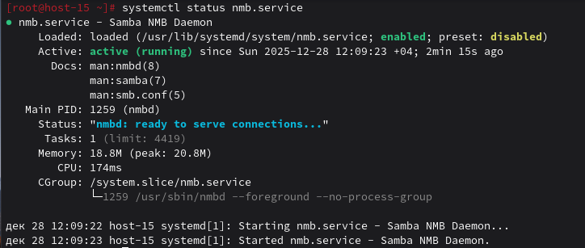
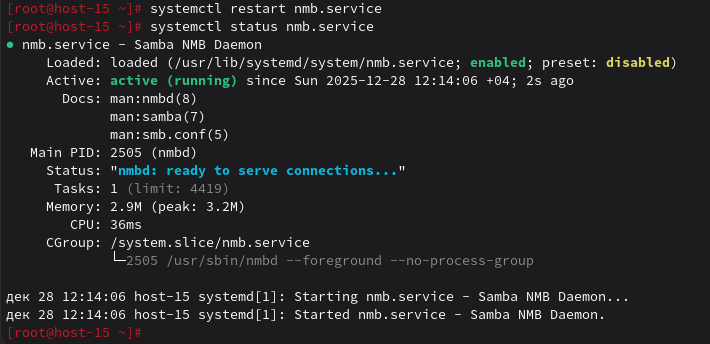
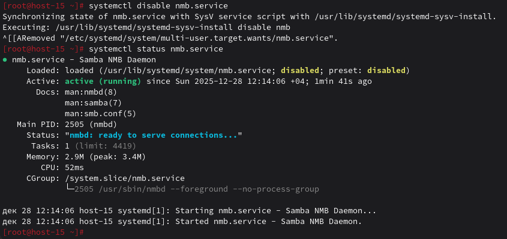
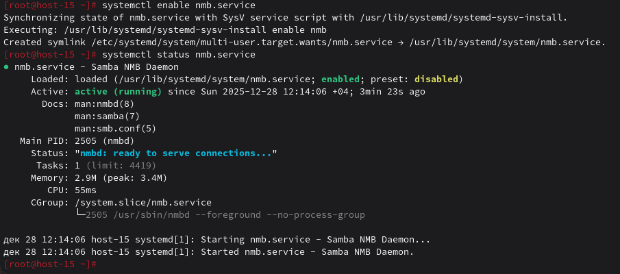

# Юниты

1. Что такое systemd юнит?<br>
Это файл конфигурации, хранящий информацию о сервисе, сокете, устройстве и т.д. <br>

2. Проверье статус любого systemd юнита, какую информацию выводит эта кманда?<br>
Далее все будет выполняться от рута.<br>
Поверяется командой ```systemctl status <юнит>```<br>
Получить сервис можно через ```rpm -ql```
На примере samba:<br>
<br>
<br>
Какую информацию выводит:
- Имя и описание сервиса
- Статус загрузки (Loaded)
- Текущее активное состояние (Active)
- Ссылки на документацию (Docs)
- Журнал событий (логи)
- использование процессора службой.

3. ПОпробуйте оставновить сервис.
```systemctl stop``` остановит службу.<br>
<br>

4. Перезапустите его.<br>
Используем ```systemctl start```:<br>
<br>

5. УДалите из автозагрузки
Используем ```systemctl disable```:<br>
<br>


6. Верните обратно
Для добавления в автозагрузку используется ```systemctl enable --now <имя_службы>```. Сразу же запустится и добавится в автозагрузку.<br>
```systemctl enable``` включит автозагрузку, но не запустит сейчас.<br>
<br>

7. Что такое таймеры?<br>
Это составная часть systemd. Таймеры для управления событиями и службами. Является альтернативой cron