# Пишем юниты

1. Создайте скрипт который создаёт папку заполняет её файлами ( имена 1-4 ) и записывает в них информацию
о текущей дате, версии ядра, имени компьютера и списе всех файлов в домашнем каталоге пользователя от которого выполняется скрипт( не забудьте сдлеать проверку на существование файлов и папок)<br>
Создадим скрипт: ```nano ~/scripts/info_collector.sh```<br>
```
#!/bin/bash

# Путь в домашнем каталоге
TARGET_DIR="$HOME/system_info"

# Создаём папку, если нет (-p)
mkdir -p "$TARGET_DIR"

CURRENT_DATE=$(date)
KERNEL_VERSION=$(uname -r)
HOSTNAME=$(hostname)
HOME_FILES=$(ls -1 ~)

# Записываем в файлы 1-4
for i in {1..4}; do
    FILE_PATH="$TARGET_DIR/$i"
    if [ -e "$FILE_PATH" ]; then
        echo "Файл $FILE_PATH уже существует, перезаписываем..."
    fi
    {
        echo "Дата и время: $CURRENT_DATE"
        echo "Версия ядра: $KERNEL_VERSION"
        echo "Имя компьютера: $HOSTNAME"
        echo "Файлы в домашнем каталоге:"
        echo "$HOME_FILES"
    } > "$FILE_PATH"
done

echo "Информация в $TARGET_DIR"
```
Ctrl + O, Enter, Ctrl + X - файл сохранен.
Сделаем его исполняемым: ```chmod +x ./info_collector.sh```
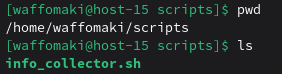<br>

2. Создайте юнит который будет вызывать этот скрипт при запуске. Проверьте<br>
Где будет располагаться: ```/etc/systemd/system/info-collector.service```<br>
Создадим: ```sudo nano ./info_collector.service```<br>
```
[Unit]
Description=Сбор системной информации
After=network.target

[Service]
Type=oneshot
ExecStart=/home/waffomaki/scripts/info_collector.sh
User=waffomaki
Group=waffomaki
RemainAfterExit=yes

[Install]
WantedBy=multi-user.target
```
Обновим systemd и запустим:<br>
```sudo systemctl daemon-reload```<br>
```sudo systemctl start info_collector.service```<br>
```sudo systemctl status info_collector.service```<br>
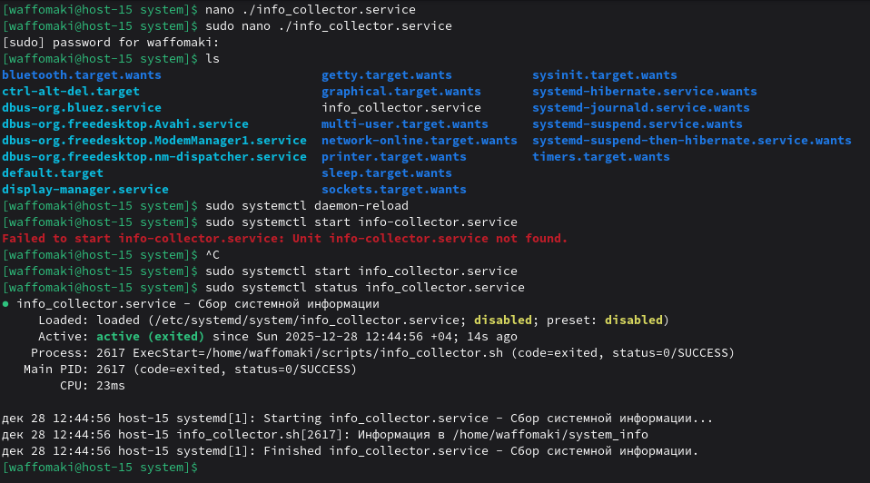<br>
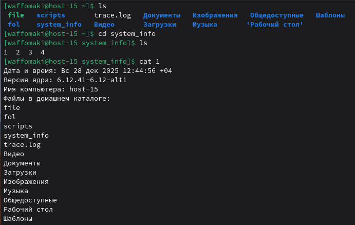<br>

3. Создайте таймер который будет вызывать выполнение одноимённого systemd юнита каждые 5 минут.<br>
Расположение: ```/etc/systemd/system/info-collector.timer```
Создадим: ```sudo nano info-collector.timer```<br>

```
[Unit]
Description=Запуск сбора информации каждые 5 минут

[Timer]
OnBootSec=1min
OnUnitActiveSec=5min
Unit=info_collector.service

[Install]
WantedBy=timers.target
```
Включим и запустим:<br>
```sudo systemctl enable --now info-collector.timer```
```sudo systemctl list-timers```
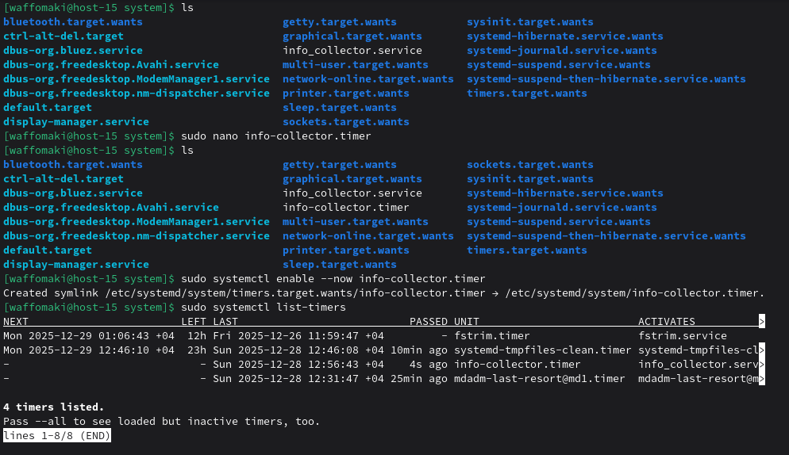<br>

4. От какого пользователя вызыаются юниты поумолчанию?<br>
Системные юниты из /etc/systemd/system/ запускаются от root, но я указал User=waffomaki и Group=waffomaki, поэтому от waffomaki.<br>

5. Создайте пользователя от имени которого будет выполняться ваш скрипт.<br>
Пусть будет имя s_inf.<br>
```sudo useradd -m -s /bin/bash s_inf```, -m создание домашнего каталога, -s оболочка.<br>
Переносим скрипт:<br>
```sudo cp /home/waffomaki/scripts/info_collector.sh /home/s_inf/scripts/```
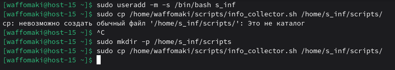<br>

6. Дополните юнит информацией о пользователе от которого должен выплняться скрипт.<br>
Откроем юнит: ```sudo nano /etc/systemd/system/info_collector.service```<br>
Меняем User и Group на созданного s_inf<br>:
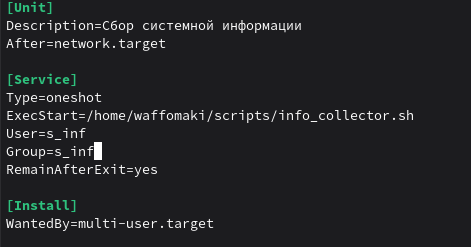<br>
Перезагружаем, параллельно изменяем права:
```sudo systemctl daemon-reload```
```sudo systemctl restart info_collector.service```
```sudo systemctl status info_collector.service```
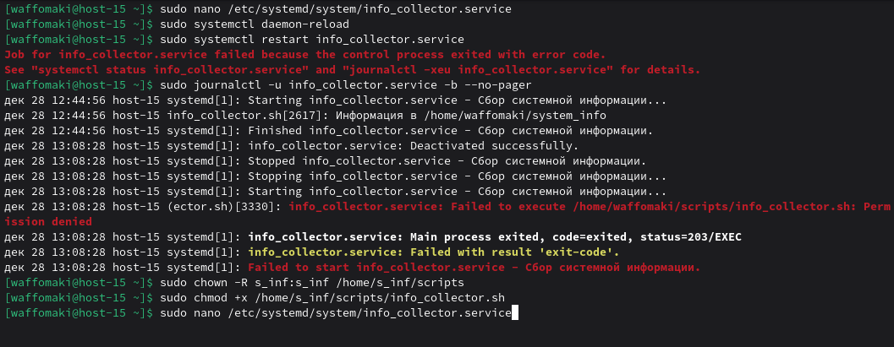<br>
Меняем ExecStart:
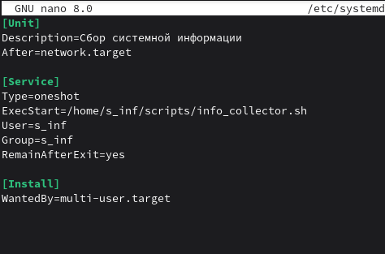<br>
Итог:
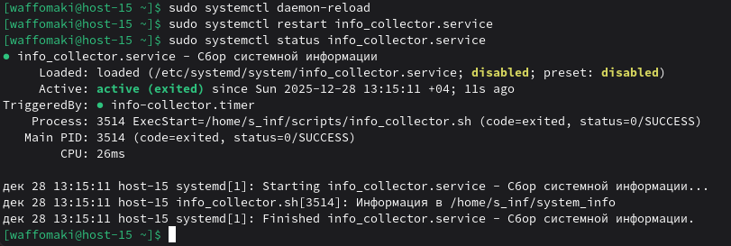<br>
Перепроверим через s_inf:<br>
```sudo -u s_inf /home/s_inf/scripts/info_collector.sh```
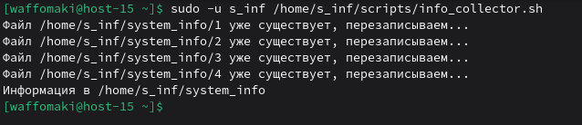<br>
Значит, systemd тоже будет работать.<br>

7. Дополните ваш скрипт так, что бы он независимо от местоположения всега выполнялся в домашней папке того кто его вызывает.<br>
Открываем ```/home/s_inf/scripts/info_collector.sh``` через nano и добавляем единственную строчку:
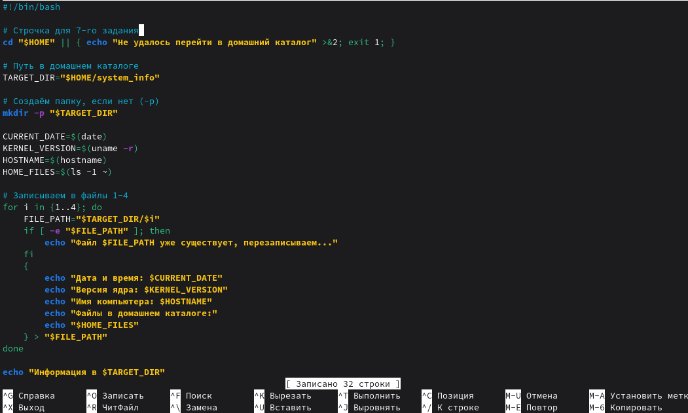<br>


