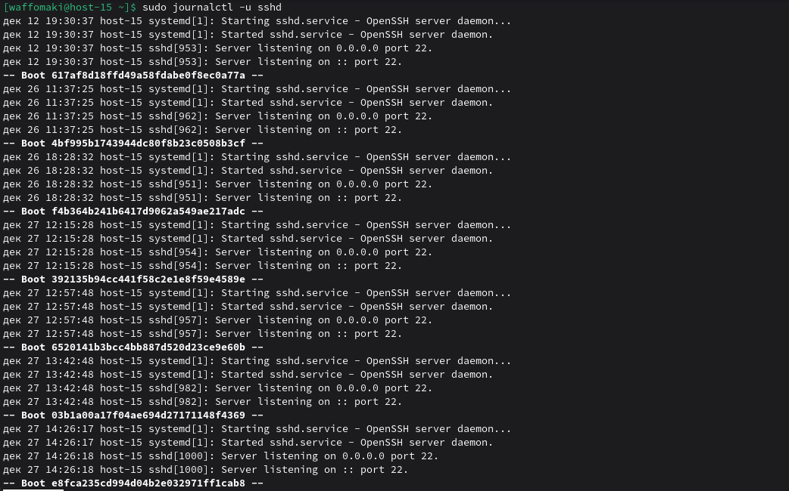
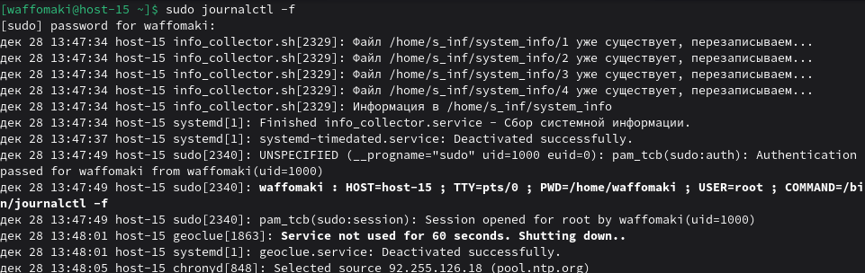
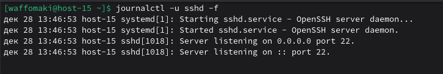
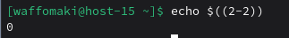

# Журнальчики

1. Посмотретите журналы ssh<br>
Используем ```sudo journalctl -u sshd```, где -u показывает логи только данного юнита:


2. Выведите журналы в реальном времени
Используем ```sudo journalctl -f```, где -f = follow (следование за новыми записями)


3. Выведите лог в реальном времени для службы sshd
Используем ```journalctl -u sshd -f```. Комбинация предыдущих:



4. Можно ли без комады journalctl прочитать логи systemd?
Напрямую - нет, потому что логи хранятся в бинарном виде. Но если система настроена на копирование логов в /var/log/, то можно читать их через cat и т.д. Но это уже не "логи systemd", а их копия в syslog-формате

5. Сколько будет 2-2?
```echo $((2 - 2))```
