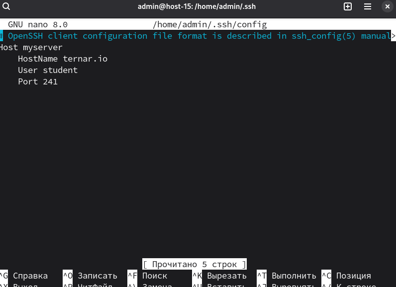
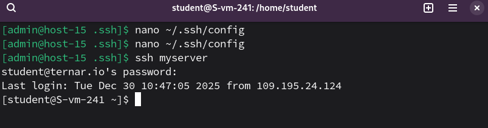

# Конфижим для удобства

1. Где хранятся пользвательские и системные настройки подключения?<br>
Пользовательские: ```~/.ssh/config```
Системные: ```/etc/openssh/ssh_config```

2. Что за файл options?<br>
Если речь о ```~/.ssh/config```, то это файл конфигурации SSH-клиента, в котором можно указывать алисы для подключений: хост, порт, пользователя и т.д.

3. Отредактируйте файл options так, чтобы можно было подключаться не вводя имя пользвателя и порт<br>
Открываем: ```nano ~/.ssh/config```<br>
Добавляем блок:
```
Host myserver
    HostName ternar.io
    User student
    Port 241
```


4. Назовите подключение удобным для вас спсобом<br>
Пусть будет ```myserver```.

5. Проверьте работоспособность<br>
```ssh myserver```<br>


