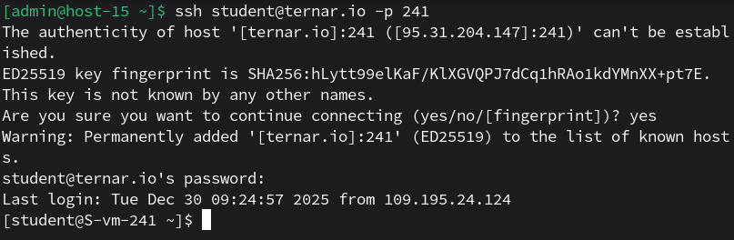
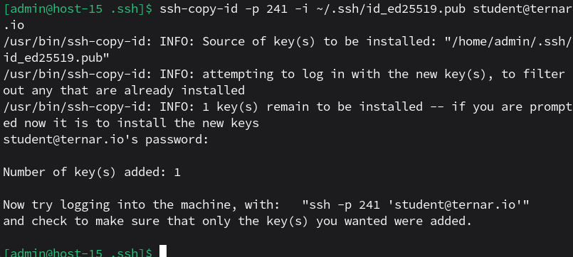
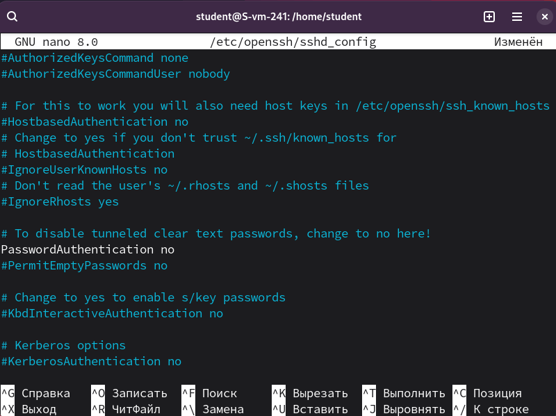
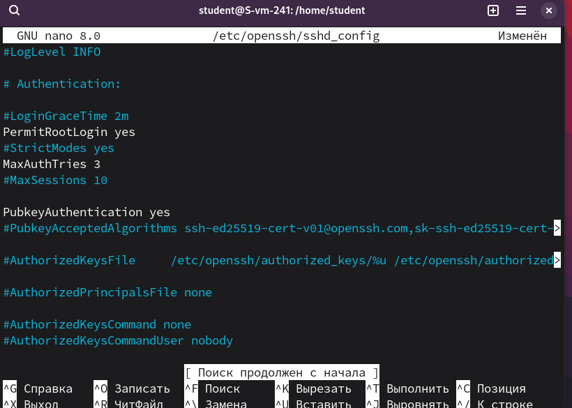
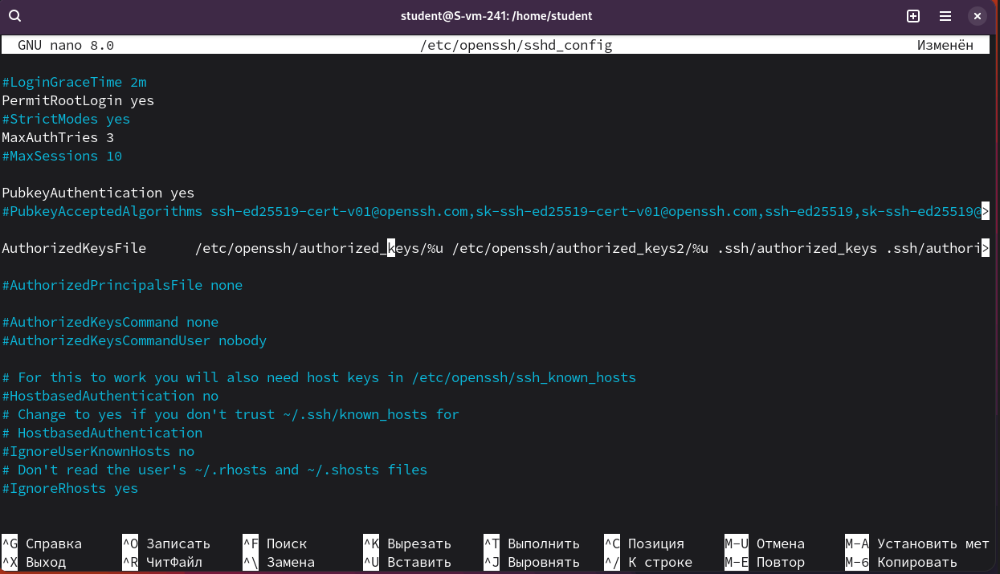
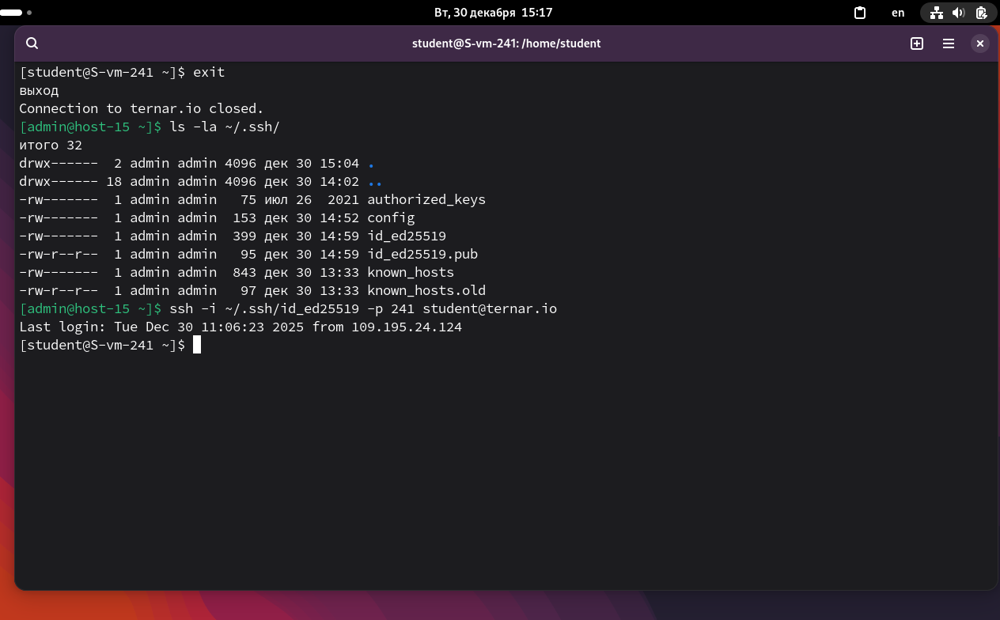

# Ключики

1. Что такое ssh ключи и зачем они нужны?<br>
Это пара файлов:<br>
- Приватный ключ (id_ed25519) - никогда не передаётся.<br>
- Публичный ключ (id_ed25519.pub) - копируется на сервер, к которому хочешь подключаться.<br>
Нужны для: безопасной аутентификации (потому что надёжнее пароля), автоматического подключения (без ввода пароля), защиты от брутфорса (если отключить вход по паролю).

2. Как их создать?<br>
```ssh-keygen -t ed25519"```.<br>
Здесь ```-t ed25519``` - тип ключа<br>

3. Создайт пару публичный/приватный ключ ed_25519, где они хранятся?<br>
<br>
Хранятся:<br>
- Приватный ключ: ```~/.ssh/id_ed25519```<br>
- Публичный ключ: ```~/.ssh/id_ed25519.pub```<br>

4. Скопируйте публичный ключ на ваш сервер, в каком файле он будет храниться?<br>
```ssh-copy-id -p 241 -i ~/.ssh/id_ed25519.pub student@ternar.io```<br>
<br>
Хранится в: ```~/.ssh/authorized_keys```<br>

5. Попробуйте подключиться к серверу, у вас запросили пароль?<br>
Нет, не запросили. Могли запросить passphrase, но я его не указал.

6. Запретите подключение с паролем для всех пользователей, оставьте только с помощью ключа.<br>
Открываем ```/etc/openssh/sshd_config``` и изменяем:<br>
- ```PasswordAuthentication no```
- ```PubkeyAuthentication yes```
- ```AuthorizedKeysFile .ssh/authorized_keys```
<br>
PasswordAuthentication:<br>
<br>
PubkeyAuthentication:<br>
<br>
AuthorizedKeysFile:<br>
<br>
Проверяем:<br>
<br>
