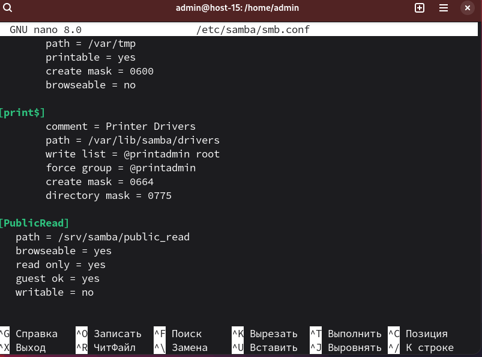
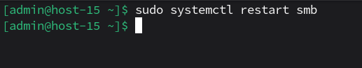
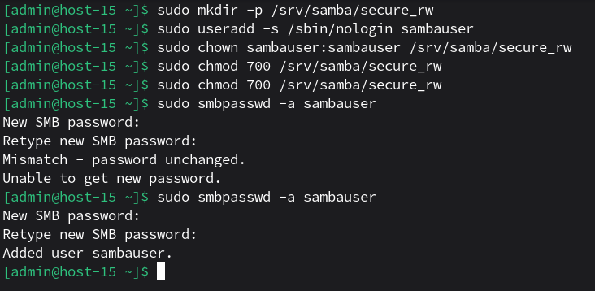
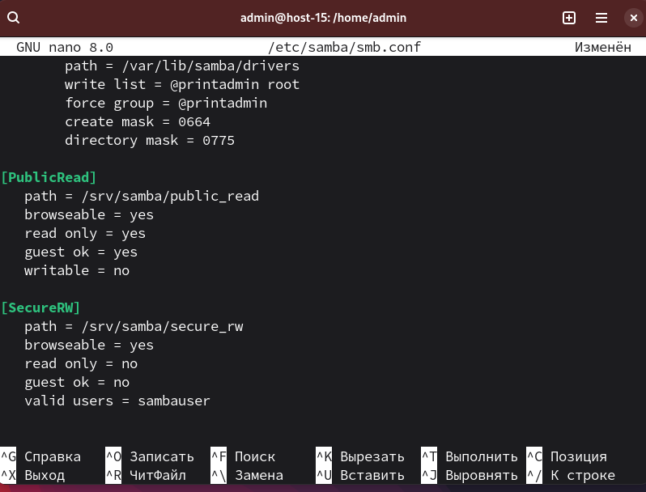
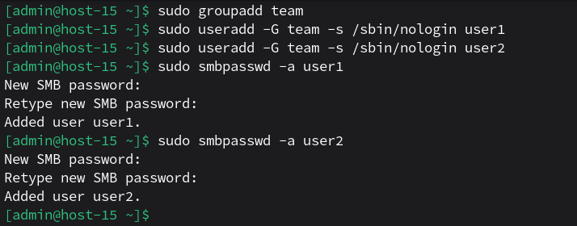
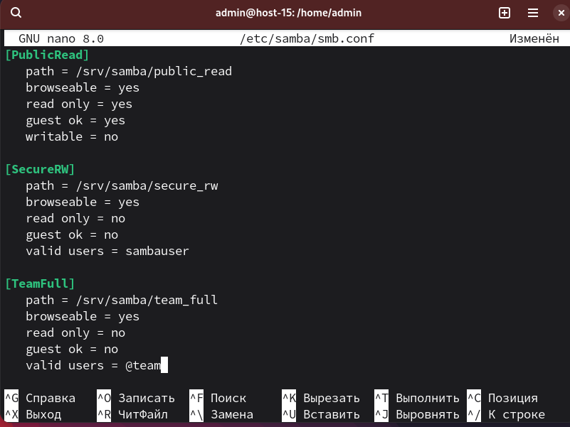
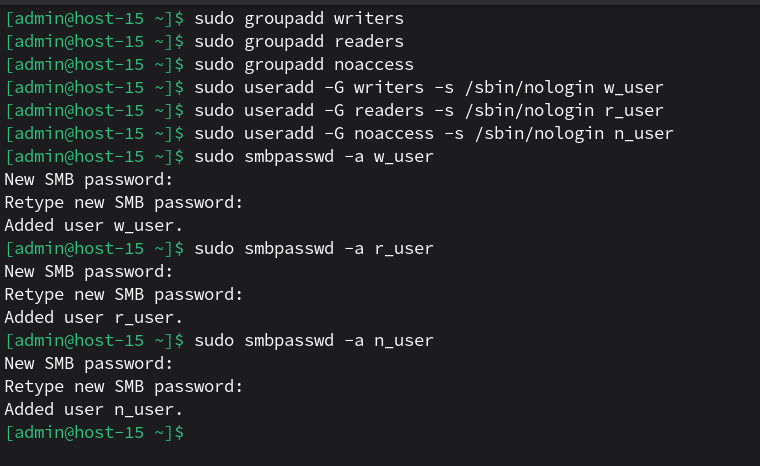
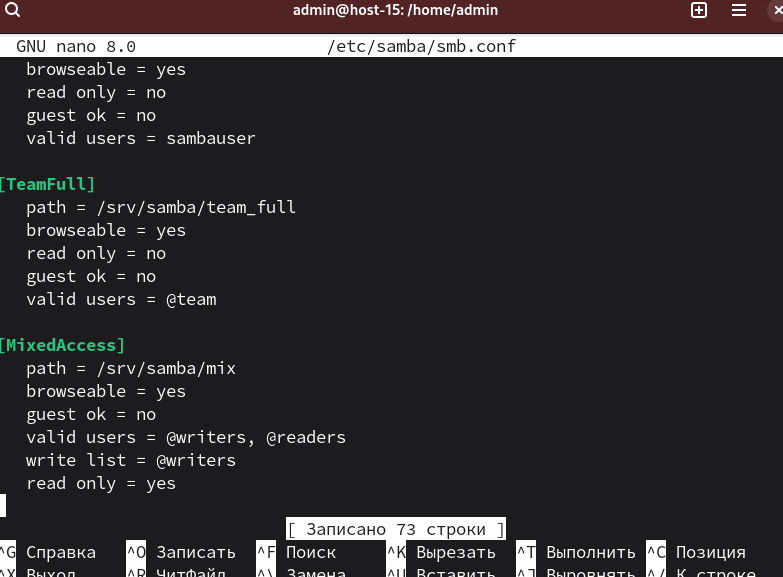

# Шарим


1. Установите пакет samba<br>
Уже устанавливал в каком-то задании: ```sudo apt-get install samba```<br>

2. ЧТо такое побщая папка, зачем оно может быть нужно?<br>
Общая папка (Share) — это каталог на сервере, доступный по сети другим пользователям или компьютерам.<br>
Что дает:<br>
- Совместная работа над файлами в локальной сети.<br>
- Доступ с Windows-машин к файлам на Linux-сервере.<br>
- Общее хранение данных.<br>
- Управление доступом: кто может читать, писать и/или удалять.<br>

3. Создайте общую папку без пароля с правами только на чтение файлов<br>
Создаем папку:<br>
```sudo mkdir -p /srv/samba/public_read```<br>
```sudo chmod 755 /srv/samba/public_read```<br>
```echo "На чтение" | sudo tee /srv/samba/public_read/test.txt```<br>
Открываем конфиг samba: ```sudo nano /etc/samba/smb.conf```<br>
Добавляем в конец:<br>
```
[PublicRead]
   path = /srv/samba/public_read
   browseable = yes
   read only = yes
   guest ok = yes
   writable = no
```
<br>
Пояснение: ```guest ok = yes``` разрешает доступ без пароля, а ```read only = yes``` запрещает запись. Browseable это параметр файлового сервера Samba, который определяет, отображается ли общий ресурс в списке доступных общих ресурсов в сетевом окружении и в списке просмотра.<br>
Перезапускаем samba: ```sudo systemctl restart smb```<br>
<br>

4. Создайте общую папку с паролем с правами на чтение и запись<br>
Создадим папку и пользователя:<br>
```sudo mkdir -p /srv/samba/secure_rw``` - создаем папку<br>
```sudo useradd -s /sbin/nologin sambauser``` - добавляем пользователя<br>
```sudo chown sambauser:sambauser /srv/samba/secure_rw``` - делаем onwer'ом<br>
```sudo chmod 700 /srv/samba/secure_rw``` - выставляем права<br>
Добавим пользователя в samba: ```sudo smbpasswd -a sambauser```<br>
Пароль - smbUsR<br>
<br>
Добавим в smb.conf: ```sudo nano /etc/samba/smb.conf```:<br>
```
[SecureRW]
   path = /srv/samba/secure_rw
   browseable = yes
   read only = no
   guest ok = no
   valid users = sambauser
```
<br>
Перезапускаем: ```sudo systemctl restart smb```<br>
Теперь можно подключаться как ```sambauser``` с паролем.

5. Создайте общую папку с доступом для какой-то группы с полными правами<br>
Создадим группу и пользователей:<br>
```sudo groupadd team``` - создаем группу team<br>
```sudo useradd -G team -s /sbin/nologin user1``` - создаем user1 в группу<br>
```sudo useradd -G team -s /sbin/nologin user2``` - создаем user2 в группу<br>
Добавим в samba:<br>
```sudo smbpasswd -a user1``` - также установим пароль для user1: пароль groupUsR1
```sudo smbpasswd -a user2``` - аналогично для user2: пароль 
Создаем папку:<br>
```sudo mkdir -p /srv/samba/team_full```
```sudo chgrp team /srv/samba/team_full``` - смена группы
```sudo chmod 2770 /srv/samba/team_full``` - setgid + rwx для группы
2770 = 2 - setgid (новые файлы наследуют группу team), 770 - rwx для владельца и группы, ничего для остальных.
<br>
Отредактируем ```smb.conf```:<br>
```
[TeamFull]
   path = /srv/samba/team_full
   browseable = yes
   read only = no
   guest ok = no
   valid users = @team
```
<br>
Здесь @team - все пользователи группы team.<br>
Перезапускаем: ```sudo systemctl restart smb```<br>

6. Создайте общую папку в которой у одной группы будет полный доступ, а у другой только доступ на чтение.<br>
Третья группа не должна иметь к ней доступа<br>
Создаем группы:<br>
```sudo groupadd writers``` - запись<br>
```sudo groupadd readers``` - чтение<br>
```sudo groupadd noaccess``` - группа без доступа<br>
Создаем юзеров и добавляем сразу же в группы:<br>
```sudo useradd -G writers -s /sbin/nologin w_user```<br>
```sudo useradd -G readers -s /sbin/nologin r_user```<br>
```sudo useradd -G noaccess -s /sbin/nologin n_user```<br>

Добавим в samba:<br>
```sudo smbpasswd -a w_user```, пароль - writeUsR<br>
```sudo smbpasswd -a r_user```, пароль - readUsR<br>
```sudo smbpasswd -a n_user```, пароль - naUsR<br>

<br>

Создаем папку:<br>
```sudo mkdir -p /srv/samba/mix``` - создаем папку<br>
```sudo chown :writers /srv/samba/mix``` - меняем owner'а<br>
```sudo chmod 2775 /srv/samba/mix``` - rwx для владельца и группы, rx для других<br>

Редактируем ```smb.conf```:<br>
```
[MixedAccess]
   path = /srv/samba/mix
   browseable = yes
   guest ok = no
   valid users = @writers, @readers
   write list = @writers
   read only = yes
```
<br>
Здесь:<br>
- valid users — кто вообще может подключиться.<br>
- read only = yes — по умолчанию только чтение.<br>
- write list = @writers — эти пользователи/группы могут писать, несмотря на read only.<br>

Перезапускаем: ```sudo systemctl restart smb```