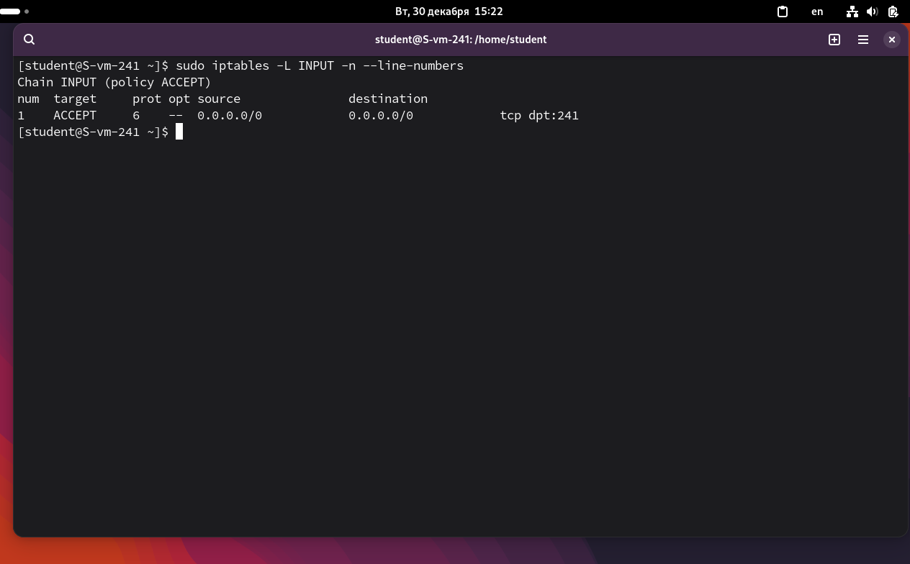

# Открываем iptables

1. Установите iptables<br>
```sudo apt-get install iptables```<br>

2. Проверьте осталась ли возможность подключения по ssh к вашему серверу<br>
Да, осталась<br>

3. Почему может пропасть такая возможность?<br>
Если не разрешён порт 241.<br>

4. Откройте нужный порт на сервере чтобы восстановить подключение<br>
Разрешаем входящие соединения:<br>
```sudo iptables -A INPUT -p tcp --dport 241 -j ACCEPT```, здесь ```-A INPUT``` добавляет правило в цепочку INPUT, ```-p tcp``` протокол TCP, ```--dport 241``` порт 241, ```-j ACCEPT``` разрешает пакет<br>


5. Это будет udp или tcp прот?<br>
SSH использует TCP протокол.<br>

# Сохраняем

6. Сохраняются ли записанные вами правила после перезагрузки?<br>
Нет, после перезагрузки пропадают.<br>

7. Как их сохранить?<br>
```sudo iptables-save > /etc/sysconfig/iptables``` - сохраняем
```sudo systemctl enable iptables``` - включаем службу
```sudo systemctl restart iptables``` - перезапуск службы


При работе с firewall не рекомендую отключаться от текущей сессии ssh. Лучше подключаться из другой консольки.