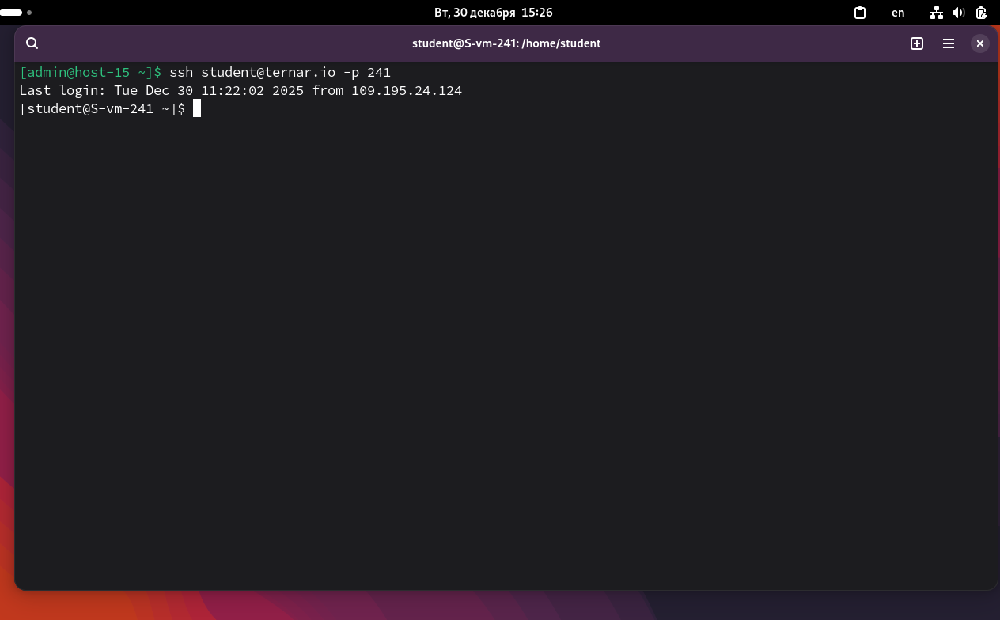
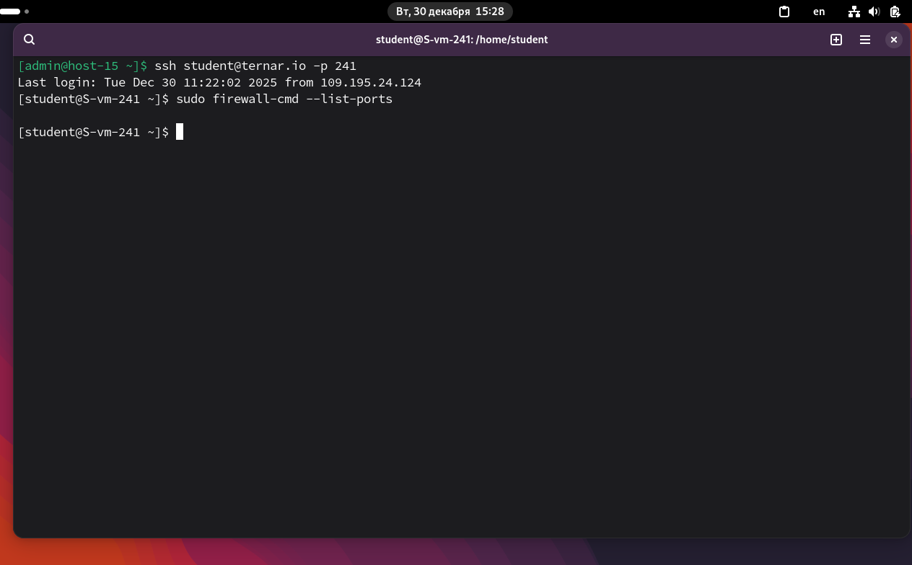
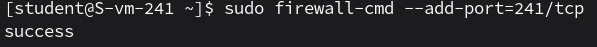
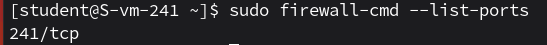
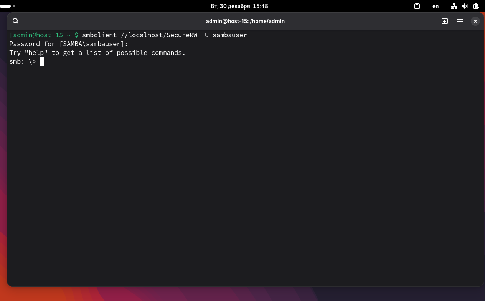
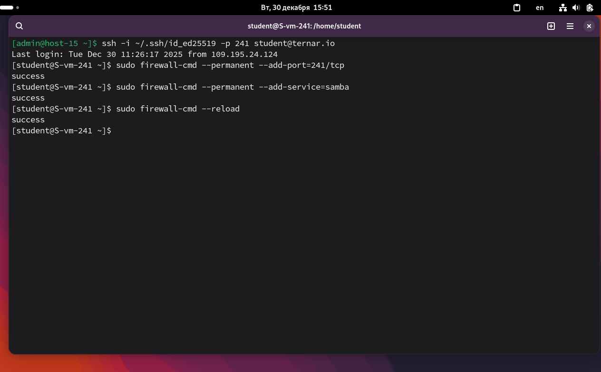

# Открываем firewald

1. Удалите iptables и установите firewalld<br>
```sudo apt-get remove iptables```<br>
```sudo apt-get install firewalld```<br>
Настроим запуск:<br>
```sudo systemctl enable firewalld```<br>
```sudo systemctl start firewalld```<br>

2. Попробуйте так-же проверить возможность подключения по ssh<br>
```ssh student@ternar.io -p 241```<br>
Работает.


3. Если её нет то откройте порт<br>
Если бы не было: ```sudo firewall-cmd --add-port=241/tcp```<br>

4. Выведите список открытых портов с помощью firewall-cmd<br>
```sudo firewall-cmd --list-ports```<br>

Список пустой, потому что порты были открыты через iptables.

5. Можно ли там добавить порты по названию сервиса?<br>
Можно: ```sudo firewall-cmd --add-service=ssh```<br>
Стандартный сервис ssh добавляет порт 22, поэтому для нестандартного используется --add-port.<br>
```sudo firewall-cmd --add-port=241/tcp```<br>
<br>
Перепроверяем:<br>
<br>

6. На вашей Локальной виртуальной машине попробуйте подключиться к серверу samba из предыдущих заданий<br>
<br>

7. Если не получилось то откройте нужные порты<br>
Получилось<br>
Получилось

9. Сделайте так чтобы изменения были постоянными<br>
Добавим флаг ```-permanent```, перезагрузим правило:<br>
```sudo firewall-cmd --permanent --add-port=241/tcp``` - SSH
```sudo firewall-cmd --permanent --add-service=samba``` - samba
```sudo firewall-cmd --reload```<br>
<br>