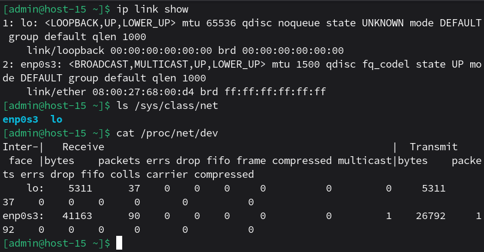
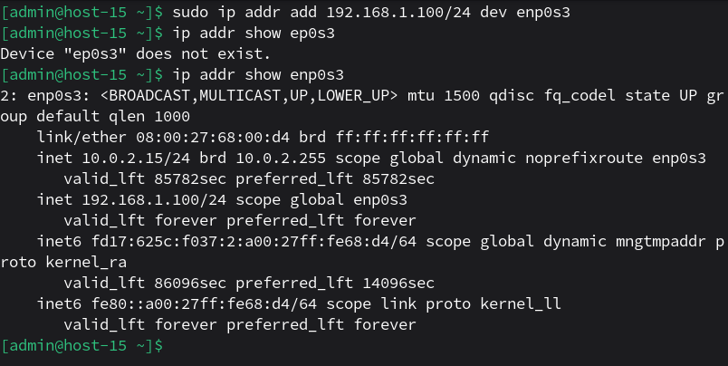
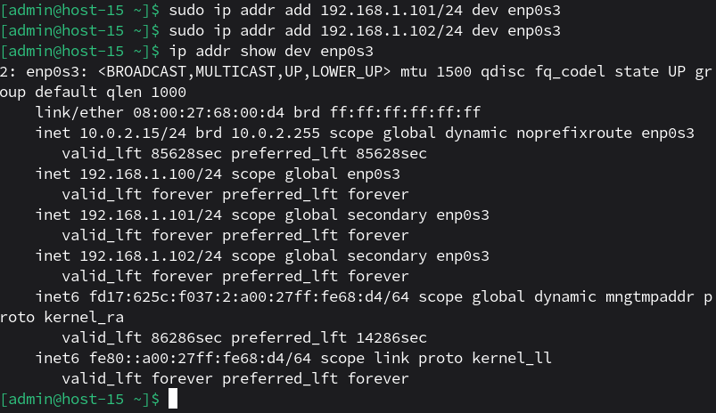
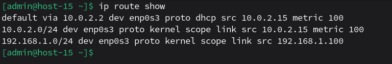
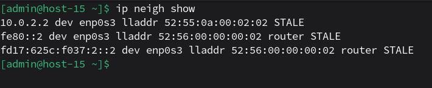

# сети

1. Выведите список интерфейсов, какими способами можно это сделать?<br>
Их можно найти в:<br>
- ```ip link show```<br>
- ```ls /sys/class/net```<br>
- ```cat /proc/net/dev```<br>
<br>

2. Попробуйте изменить ip адрес<br>
Имя интерфейса на скрине выше - enp0s3.<br>
```sudo ip addr add 192.168.1.100/24 dev enp0s3```
<br>

3. Попробуте добавить несколько ip адресов на сетевую карту<br>
```sudo ip addr add 192.168.1.101/24 dev enp0s3```<br>
```sudo ip addr add 192.168.1.102/24 dev enp0s3```<br>
<br>

4. Выведите список маршрутов<br>
```ip route show```
<br>

5. Выведите arp таблицу<br>
```ip neigh show```
<br>


6. Что такое ip адрес?<br>
Это уникальный числовой идентификатор устройства в сети, чтобы пакеты данных знали, куда идти в сети.<br>

7. Для чего нужны маршруты?<br>
Это правила в таблице маршрутизации, которые говорят, куда отправлять пакеты для определённой сети.Без них устройство не знает, как доставить пакет за пределы своей подсети.<br>

8. Что за протокол arp?<br>
Address Resolution Protocol. Это протокол, который находит MAC-адрес по IP-адресу в локальной сети. Работает только в пределах одной подсети.<br>

9. Что такое dhcp?<br>
Dynamic Host Configuration Protocol. Эротокол, который автоматически выдаёт устройствам ip-адрес, маску подсети, шлюз и dns-серверы. Без него пришлось бы вручную настраивать каждый компьютер в сети.<br>

10. Что такое dns?<br>
Domain Name System. Система, которая преобразует доменные имена в IP-адреса. По сути, телефонная книга в интернете.<br>

11. Как называется один из протоколов синхронизации времени?<br>
Network Time Protocol. Он используется для точной синхронизации времени между компьютерами в сети.<br>
Либо Precision Time Protocol.<br>

12. Что такое широковещательный запрос, зачем он нужен?<br>
Broadcast запрос. Это пакет, который отправляется всем устройствам в локальной сети. Доставляется по широковещательному ip.<br>

13. Какой адресс является широковещательным?<br>
Это адрес, у которого биты хоста равны единице. Последний адрес подсети.<br>

14. Какие ещё параметры можно задать сетевой карте?<br>
Апаратный адрес (mac), максимальный размер пакета (mtu), скорость и дуплекс, шлюз по умолчанию (default gateway), dns-сервер и имя сервера.<br>

15. Что такое маска подсети? зачем она нужна?<br>
Это число, которое разделяет ip на сетевую и хостовую части, чтобы устройство понимало, какие адреса находятся в локальной сети и доступны напрямую, а какие — за пределами и требуют шлюза.<br>
