# Первое самостоятельное задание с пары

1) Установить пакеты samba bind bind-utils и любой питоновский модуль
    В alt-linux используется расширение пакетов **rpm**, а также пакетный менеджер **apt-get**.
    У обычного юзера **не хватает прав** для установки пакетов:
    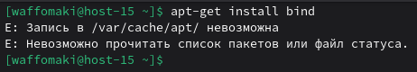
    Зайдем под рутом через ```su -```:
    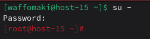
    Тепрь установим пакеты samba, bind, bind-utils через ```apt-get install <название_пакета>```:
    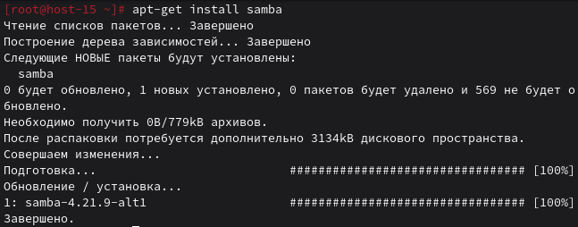
    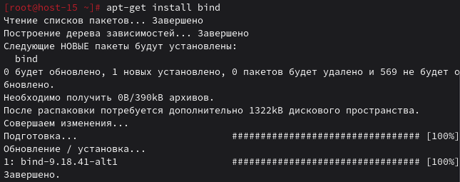
    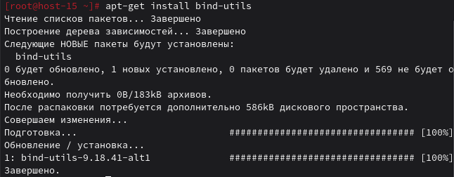
    Установим аналогично python:
    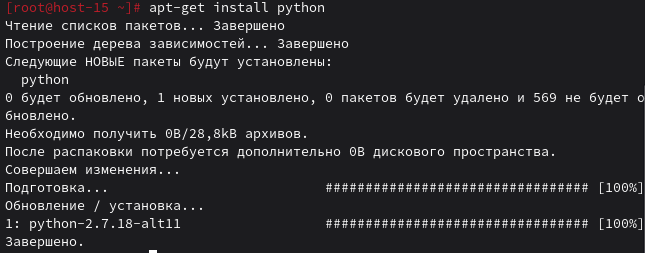
    Теперь можно установить, например, flake8, но перед этим установим pip:
    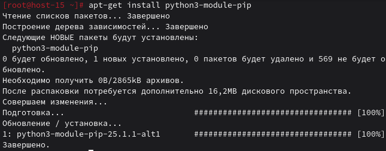
    Устанавливаем flake8:
    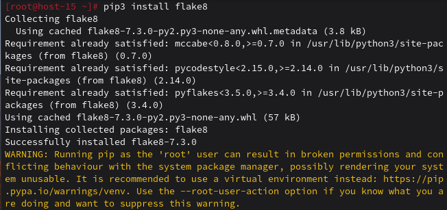

2) Вывести:
    rpm хранит информацию о пакетах. Получить доступ к полной информации о пакете можно через ```apt-cache show <имя_пакета>```.
    2.1) Версию
    Можно через ```rpm -q <имя_файла>```:
    
    2.2) Файлы пренадлежащие пакету
    Можно получить через ```rpm -ql <имя_пакета>```:
    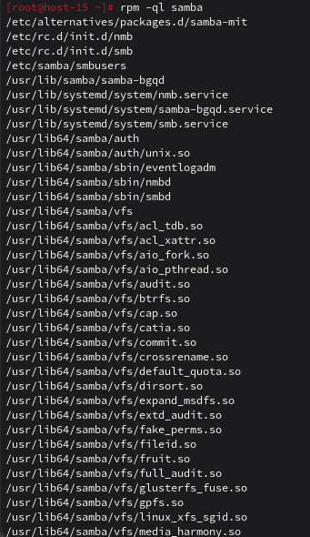
    2.3) Зависимости
    Можно получить через ```apt-cache depends <имя_пакета>```:
    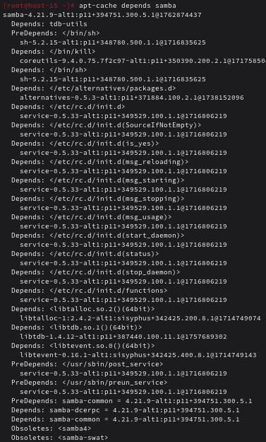
3) Проверить службы установленных пакетов, еси не запущенны запустить, добавить в автозагрузку
    В alt используется система инициализации **Systemd**
    Основной инструмент для работы - **systemctl**
    Узнать юнит пакета можно через ```rpm -ql```, посмотрев на ```/usr/lib/systemd```.
    Используем ```systemctl status <имя_юнита>``` для проверки, работает ли он.
    На примере samba:
    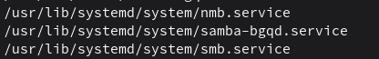
    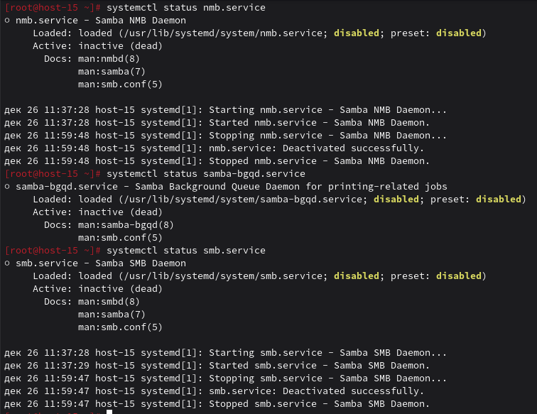
    ```systemctl start``` запустит службу.
    Для добавления в автозагрузку используется ```systemctl enable --now <имя_службы>```. Сразу же запустится и добавится в автозагрузку.
    ```systemctl enable``` включит автозагрузку, но не запустит сейчас.
    Использование ```systemctl enable --now``` на примере samba:
    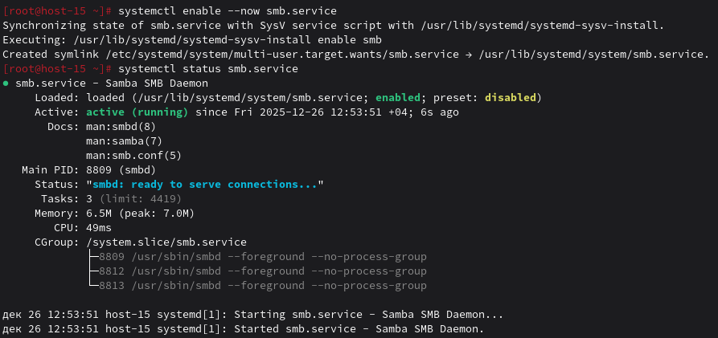
    Аналогично для каждой службы каждого пакета.
    3.1) можно ли включить и добавить в автозагрузку одной командой?
    Да, описал выше.
4) Найти и вывести конфигурационные файлы пакетов у которых они есть
    Используем ```rpm -qc <имя_пакета>```:
    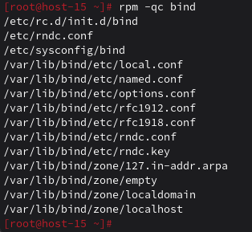